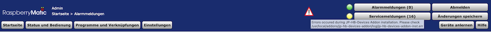
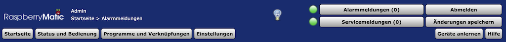
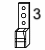
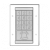
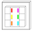

# JP-HB-Devices-addon    

**✅ lauffähig unter CCU / RaspberryMatic Firmware 3.47.10 - 3.57.5 [inkl. x86]** 
**❓ CCU2 Firmware 2.53.27 - 2.57.4 nur experimentell unterstützt (nicht real getestet; nur gegen ubi-Image)** 
Die jeweils aktuellste Version ist bei den [Releases](https://github.com/jp112sdl/JP-HB-Devices-addon/releases/latest) zu finden.  
❗❗❗ **Vor dem Update auf Version 5 unbedingt lesen:** ❗❗❗ 
Die Update Prozedur wurde grundlegend verändert. Ist bereits eine frühere Version des Addons (V4.x oder kleiner) installiert, ist eine der beiden folgenden Methoden einmalig beim Wechsel auf die Version 5 anzuwenden: 
- Variante 1: 
  - altes Addon deinstallieren
  - Version 5 installieren
  - **wichtig: zwischen der Deinstallation des alten und der Installation des neuen Addons darf kein Neustart erfolgen**
- Variante 2: 
  - Version 5 installieren
  - anschließend die CCU Firmware erneut installieren
  

Die **sicherste** Methode ist **Variante 2**.  _Aufgrund der CCU Firmware-Neuinstallation ist garantiert, dass alle Systemdateien im Ursprungszustand vorhanden sind und gepatcht werden können._ 
Bei Variante 1 ist (aufgrund von Bugs in den Uninstall-Routinen) nicht auszuschließen, dass Reste in den Systemdateien verbleiben und das Patchen somit nicht möglich ist.

Treten Fehler während der Addon-Installation auf, erscheint nach dem Reboot ein Warndreieck in der WebUI Oberfläche! 
 
Mit einem Klick auf das Warndreieck-Symbol kann die Logdatei heruntergeladen werden.

Bitte auch die CCU Firmware spezifischen [Hinweise](https://jp112sdl.github.io/JP-HB-Devices-addon/jphbInfoPage) lesen und beachten! 
Dazu bitte die "Glühlampe" in der WebUI anklicken. Sie wird nach jeder Addon- aber auch CCU-Firmware-Installation eingeblendet, bis sie 1x angeklickt wurde. Zukünftig möchte ich dort auf generelle CCU-Fehler hinweisen, die unabhängig der HomeBrew Geräte existieren. 

**Das Wichtigste vorweg:** 
Dieses Addon integriert die unten aufgelisteten HomeBrew Projekte in die CCU-Firmware. 
Ich stelle es 
* kostenfrei 
* ohne jeglichen Anspruch auf vollständige Funktion 
* auf eigene Gefahr (z.B. unerwünschte Nebeneffekte in der CCU-Firmware)

zur Verfügung. 
Da es sich um ein reines Hobby-Projekt handelt, kann ich **weder (umfangreichen) Support** leisten, **noch auf individuelle Wünsche eingehen** oder **zeitnah die neueste CCU-Firmware unterstützen**! 
Es sollte klar sein, dass mit (m)einer eventuellen Aufgabe dieses Hobbys, mittel-/langfristig (teilweise) keine Verwendung u.g. Geräte mehr möglich ist. <i>Wie bei Open Source Projekten üblich, kann sich jedoch jeder an der Entwicklung beteiligen!</i>

Nach der Installation wird automatisch ein Neustart der Zentrale durchgeführt. 
Die eigentliche Installation des Addons erfolgt nach diesem Neustart, während die Zentrale hochfährt. 
In dieser Zeit werden die Dienste **ReGaHss** und **RFD** gestoppt, so dass es **_(nicht bei RaspberryMatic!)_** im Browser zu der Meldung `Eine Komponente der Homematic Zentrale reagiert nicht mehr.` kommen kann. 
_Bitte etwas Geduld haben - je nach Geschwindigkeit der SD Karte kann die Installation u.U. mehrere Minuten in Anspruch nehmen!_  

❗ Sollten anschließend keine Geräte-Icons und/oder -beschreibungen in der WebUI angezeigt werden, muss der Browser-Cache gelöscht werden.

#### Dieses Addon wird benötigt, um die Kompatibilität der folgenden HomeMatic Selbstbaugeräte herzustellen:

|  | Name | Beschreibung | 🔋Batterie-/ ⚡️Netzbetrieb |
|--------|--------|--------|:--------:|
| | [HB-UNI-Sen-CAP-MOIST](https://github.com/jp112sdl/HB-UNI-Sen-CAP-MOIST) | kapazitiver Bodenfeuchtesensor _optional mit DS18B20 Temperatursensor_ | 🔋 |
| | [HB-UNI-Sen-DIST-TOF](https://github.com/jp112sdl/HB-UNI-Sen-DIST-TOF) | Time-of-Flight Abstandsensor | 🔋 |
| | [HB-UNI-Sen-DIST-US](https://github.com/jp112sdl/HB-UNI-Sen-DIST-US) | Ultraschall Abstandsensor | 🔋 |
| | [HB-UNI-Sen-LEV-TOF](https://github.com/jp112sdl/HB-UNI-Sen-LEV-TOF) | Time-of-Flight Füllstandsensor | 🔋 |
| | [HB-UNI-Sen-LEV-US](https://github.com/jp112sdl/HB-UNI-Sen-LEV-US) | Ultraschall Füllstandsensor | 🔋 |
| | [HB-UNI-Sen-PRESS](https://github.com/jp112sdl/HB-UNI-Sen-PRESS) | Drucksensor | ⚡️ |
| | [HB-UNI-Sen-TEMP-DS18B20](https://github.com/jp112sdl/HB-UNI-Sen-TEMP-DS18B20) | 1..8fach DS18B20 Temperatursensor | ⚡️ / 🔋 | 
| | [HB-UNI-Sen-WEA](https://github.com/jp112sdl/HB-UNI-Sen-WEA) | Wetterstation | ⚡️ | 
| | [HB-UNI-SenAct-4-4](https://github.com/jp112sdl/HB-UNI-SenAct-4-4) | 4fach - Sender & - Aktor | ⚡️ / 🔋 | 
| |  [HB-UNI-SenAct-8-8](https://github.com/jp112sdl/HB-UNI-SenAct-8-8)  | 8fach - Sender & - Aktor | ⚡️ / 🔋 | 
| | [HB-UNI-RGB-LED-CTRL](https://github.com/jp112sdl/HB-UNI-RGB-LED-CTRL) | RGB Controller für WS28xx / Neopixel / etc. | ⚡️ / 🔋 | 
| | [HB-UNI-Sen-TEMP-IR](https://github.com/jp112sdl/HB-UNI-Sen-TEMP-IR) | MLX90614 Infrarot Temperatursensor | 🔋 | 
| | [HB-UNI-Sen-DUMMY-BEACON](https://github.com/jp112sdl/HB-UNI-Sen-DUMMY-BEACON) | Dummy-Device zum Simulieren zyklischer Statusmeldungen sowie Ack-Nachrichten | ⚡️ / 🔋 | 
| | [HB-UNI-Sen-DUMMY-BEACON-V2](https://github.com/jp112sdl/HB-UNI-Sen-DUMMY-BEACON-V2) | Dummy-Device zum Simulieren zyklischer Statusmeldungen sowie Ack-Nachrichten (V2) | ⚡️ | 
| | [HB-UNI-Sen-VOLT](https://github.com/jp112sdl/HB-UNI-Sen-VOLT) | universeller Spannungssensor (Template) | 🔋 |  
| | [HB-LC-Sw1PBU-FM](https://github.com/jp112sdl/Beispiel_AskSinPP/tree/master/examples/HB-LC-Sw1PBU-FM) | alternative Firmware für den HM-LC-Sw1PBU-FM (getrennte Taster-/Relais-Kanäle) | ⚡️ | 
| | [HB-LC-Sw2PBU-FM](https://github.com/jp112sdl/Beispiel_AskSinPP/tree/master/examples/HB-LC-Sw2PBU-FM) | alternative Firmware für den HM-LC-Sw2PBU-FM (getrennte Taster-/Relais-Kanäle) | ⚡️ | 
| | [HB-LC-Bl1PBU-FM](https://github.com/jp112sdl/Beispiel_AskSinPP/tree/master/examples/HB-LC-Bl1PBU-FM) | alternative Firmware für den HM-LC-Bl1PBU-FM (getrennte Taster-/Relais-Kanäle) | ⚡️ | 
| | [HB-LC-Sw2-FM](https://github.com/stan23/HB-LC-Sw2-FM) | alternative Firmware für den HM-LC-Sw2-FM (getrennte Taster-/Relais-Kanäle) special thx to [stan23](https://github.com/stan23)! | ⚡️ | 
| | [HB-UNI-DMX-Master](https://github.com/jp112sdl/HB-UNI-DMX-Master) | (sehr) einfacher DMX Master Controller | ⚡️ |  
| | [HB-Dis-EP-42BW](https://github.com/jp112sdl/HB-Dis-EP-42BW) | 4.2" ePaper Display | ⚡️ / 🔋 | 
| | [HB-Dis-EP-75BW](https://github.com/jp112sdl/HB-Dis-EP-75BW) | 7.5" ePaper Display | ⚡️ / 🔋 | 
| | [HB-UNI-Sen-RFID-RC](https://github.com/jp112sdl/HB-UNI-Sen-RFID-RC) | RFID-Reader als Sender (Tasterschnittstelle) | ⚡️ | 
| | [HB-IBUT-8](https://github.com/pa-pa/AskSinPP/tree/master/examples/custom/HB-IBUT-8) | iButton Sender Taster/Schließer | ⚡️ | 
| | [HB-OU-MP3-LED](https://github.com/jp112sdl/HB-OU-MP3-LED) | MP3-Player mit LED | ⚡️ | 
| | [HB-UNI-Sen-WEIGHT](https://github.com/jp112sdl/HB-UNI-Sen-WEIGHT) | universeller Wägesensor | 🔋 | 
| | [HB-UNI-Sen-WEIGHT-SC](https://github.com/jp112sdl/HB-UNI-Sen-WEIGHT-SC) | universeller Wägesensor mit Schließerkontakt | ⚡️ | 
| | [HB-UNI-Sen-IAQ](https://github.com/jp112sdl/HB-UNI-Sen-IAQ) | universeller Luftgütesensor _(temporarily discontinued)_ [(see HM-Forum)](https://homematic-forum.de/forum/viewtopic.php?f=76&t=49422)| 🔋 | 
| | [HB-RC-12-EP](https://github.com/jp112sdl/HB-RC-12-EP) | 12 Kanal Fernbedienung mit Farb- oder Schwarz/Weiß-ePaper-Display | 🔋 | 
| | [HB-RC-2-PBU-LED](https://github.com/jp112sdl/HB-RC-2-PBU-LED) | 2 Kanal Taster mit RGB-Hintergrundbeleuchtung | ⚡️ | 
| | [HB-OU-MOT-SERVO](https://github.com/jp112sdl/HB-OU-MOT-SERVO) | Servo-Motor Steuerung | ⚡️ | 
| | [HB-UNI-Sen-PF-SC](https://github.com/jp112sdl/HB-UNI-Sen-PF-SC) | Tierklappenüberwachung | 🔋 | 
| | [HB-OU-RGB-TEALIGHT](https://github.com/pafra-123/HB_RGB_LED_Candle) | RGB-LED-Kerze / Teelicht | ⚡️ / 🔋 | 
| | [HB-LC-Dim5PWM-CV](https://github.com/pa-pa/AskSinPP/tree/master/examples/stm32/HB-LC-Dim5PWM-CV) | 5-Kanal PWM Dimmer (STM32) | ⚡️ | 
| | [HB-UNI-Sen-TEMP-MAX6675](https://github.com/jp112sdl/HB-UNI-Sen-TEMP-MAX6675) | MAX6675 Temperatursensor bis 1000°C | 🔋 | 
| | [HB-UNI-Sen-TEMP-MAX6675-DT](https://github.com/jp112sdl/HB-UNI-Sen-TEMP-MAX6675) | MAX6675 Temperatur-Differenzsensor bis 1000°C | 🔋 | 
| | [HB-LC-Bl2-RD](https://github.com/SteMaker/HB-LC-Bl2-RD) | zwei Rolladenaktoren und ein Regensensor _([SteMaker](https://github.com/SteMaker))_ | ⚡️ | 
| | [HB-LC-Bl1-Velux](https://github.com/pa-pa/AskSinPP/tree/master/examples/custom/HB-LC-Bl1-Velux) | Velux Rolladensteuerung _([pa-pa](https://github.com/pa-pa))_ | 🔋 | 
| | [HB-Sec-RHS-3](https://github.com/pa-pa/HB-Sec-RHS-3) | Fenster-Drehgriffsensor m. Batt.-Spannungsanzeige und 4 mögl. Status _([pa-pa](https://github.com/pa-pa))_ | 🔋 | 
| | [HB-IR-Rcv-RC](https://github.com/jp112sdl/HB-IR-Rcv-RC) | IR-Empfänger -> HM Taster | ⚡️ | 
| | [HB-OU-MOT-FAN](https://github.com/jp112sdl/HB-OU-MOT-FAN)(-RPM) | PWM Lüftersteuerung (mit optionaler RPM-Überwachung) | ⚡️ | 
| | [HB-UNI-Sen-CURRENT](https://github.com/jp112sdl/HB-UNI-Sen-CURRENT) | universeller Strom-Sensor | ⚡️ / 🔋 | 
| | [HB-RC-4-Dis-TH](https://github.com/jp112sdl/HB-RC-4-Dis-TH) | 4 Kanal Taster mit Display und Temperatur- / Luftfeuchtesensor | ⚡️ / 🔋 | 
| | [HB-UNI-Sen-DUST](https://github.com/jp112sdl/HB-UNI-Sen-DUST) | Feinstaubsensor (SDS011) | ⚡️ | 
| | [HB-UNI-Sen-TEMP-SC](https://github.com/jp112sdl/HB-UNI-Sen-TEMP-SC) | (NTC) Temperatursensor mit Grenzwertschalter | 🔋 |
| | [HB-CDL-6](https://github.com/trilu2000/HB-CDL-6) | 6fach Codeschloss _([trilu2000](https://github.com/triliu2000))_ | ⚡️ | 
| | [HB-UNI-Sen-PC-WM](https://github.com/jp112sdl/HB-UNI-Sen-PC-WM) | Wasserzähler mit optischer analoger Impulserfassung (Zeiger) | 🔋 | 
| | [HB-RC-4-TOUCH](https://github.com/jp112sdl/HB-RC-4-TOUCH) | 4-fach Sender mit Touchpads (MPR121) | 🔋 | 
| | [HB-OU-AF-SEN-TEMP](https://github.com/jp112sdl/HB-OU-AF-SEN-TEMP) | (Kamin) Luftklappensteuerung und Temperatursensor | ⚡️ |
| | [HB-RC-X-POS](https://github.com/jp112sdl/HB-RC-X-POS) | Mehrkanalsender mit linearer Poti-Auswertung | 🔋 |
| | [HB-UNI-Sen-PH](https://github.com/jp112sdl/HB-UNI-Sen-PH) | PH-Sensor | ⚡️ |
| | [HB-ES-PMSw1-USB](https://github.com/jp112sdl/HB-ES-PMSw1-USB) | Schaltaktor mit Strom-/Spannungsmessung für USB | ⚡️ |
| | [HB-RC-6-PBU-LED](https://github.com/jp112sdl/HB-RC-6-PBU-LED) | 6fach (Wand)Taster mit RGB Status-LEDs | ⚡️ |

**Hinweis für Entwickler** _(verwendete Device Model meiner bzw. fremd-eingebundener HB-Geräte)_ **:**

| Device Model | Gerät |
|--------|--------|
|E9 01 | HB-UNI-Sen-PRESS |
|E9 02 | HB-UNI-Sen-PRESS-SC |
|F1 D0 | HB-UNI-Sen-WEA |
|F1 D1 | HB-UNI-Sen-IAQ |
|F2 06 | HB-IBUT-8 |
|F3 01 | HB-UNI-Sen-TEMP-DS18B20 |
|F3 06 | HB-UNI-Sen-TEMP-SC |
|F3 07 | HB-WDS40-THP-O-BME280 |
|F3 08 | HB-UNI-Sen-TEMP-IR |
|F3 09 | HB-UNI-Sen-TEMP-MAX6675 |
|F3 10 | HB-UNI-Sen-TEMP-MAX6675-DT |
|F3 11 | HB-UNI-Sen-CAP-MOIST |
|F3 12 | HB-UNI-Sen-CAP-MOIST-T |
|F3 13 | HB-UNI-Sen-LDR-SC |
|F3 14 | HB-UNI-Sen-DUST |
|F3 15 | HB-UNI-Sen-PC-WM |
|F3 16 | HB-UNI-Sen-PH |
|F3 17 | HB-UNI-Sen-PH-ORP |
|F3 20 | HB-LC-SW12-FM |
|F3 21 | HB-LC-Bl1-FM-BAT|
|F3 2B | HB-RC-X-POS |
|F3 2C | HB-RC-10-POS |
|F3 2D | HB-RC-4-TOUCH |
|F3 2E | HB-RC-4-Dis-TH-CRG |
|F3 2F | HB-RC-4-Dis-TH |
|F3 30 | HB-RC-2-PBU-LED|
|F3 31 | HB-UNI-SenAct-4-4-SC|
|F3 32 | HB-UNI-SenAct-4-4-RC|
|F3 33 | HB-UNI-SenAct-4-4-SC-BAT|
|F3 34 | HB-UNI-SenAct-4-4-RC-BAT|
|F3 35 | HB-LC-Sw1PBU-FM|
|F3 36 | HB-LC-Sw2PBU-FM|
|F3 37 | HB-LC-Bl1PBU-FM|
|F3 38 | HB-UNI-SenAct-8-8-RC|
|F3 39 | HB-UNI-SenAct-8-8-RC-BAT|
|F3 3A | HB-UNI-SenAct-8-8-SC|
|F3 3B | HB-UNI-SenAct-8-8-SC-BAT|
|F3 3C | HB-UNI-Sen-RFID-RC|
|F3 3D | HB-IR-Rcv-RC |
|F3 3E | HB-RC-6-PBU-LED|
|F3 40 | HB-OU-AF-SEN-TEMP |
|F3 41 | HB-UNI-RGB-LED-CTRL |
|F3 42 | HB-UNI-DMX-MASTER |
|F3 43 | HB-DIS-EP-42BW |
|F3 44 | HB-OU-MP3-LED |
|F3 45 | HB-RC-12-EP-29C |
|F3 46 | HB-RC-12-EP-29BW |
|F3 47 | HB-DIS-EP-75BW |
|F3 48 | HB-OU-MOT-SERVO |
|F3 49 | HB-OU-MOT-FAN |
|F3 4A | HB-UNI-Sen-VOLT |
|F3 4B | HB-UNI-Sen-WEIGHT |
|F3 4C | HB-UNI-Sen-WEIGHT-SC |
|F3 4D | HB-UNI-Sen-PF-SC |
|F3 4E | HB-UNI-Sen-CURRENT |
|F3 4F | HB-OU-MOT-FAN-RPM |
|F3 50 | HB-OU-RGB-TEALIGHT-BAT |
|F3 51 | HB-OU-RGB-TEALIGHT |
|F3 53 | HB-DIS-EP-42BW-MAINS |
|F3 57 | HB-DIS-EP-75BW-MAINS |
|F3 5A | HB-ES-PMSw1-USB |
|F3 FE | HB-UNI-Sen-DUMMY-BEACON-V2 |
|F3 FF | HB-UNI-Sen-DUMMY-BEACON |
|_F5 01_ | _HB-LC-Sw2-FM_ |
|_F5 11_ | _HB-LC-Dim5PWM-CV_ |
|F6 A9 | [HB-CDL-6](https://github.com/trilu2000/HB-CDL-6) |
|F9 D6 | HB-UNI-Sen-DIST-US |
|F9 D7 | HB-UNI-Sen-DIST-TOF |
|F9 D2 | HB-UNI-Sen-LEV-US |
|F9 D3 | HB-UNI-Sen-LEV-TOF |
|FA 00 | [HB-LC-Bl2-RD](https://github.com/SteMaker/HB-LC-Bl2-RD) |
|F2 0A | [HB-LC-Bl1-Velux](https://github.com/pa-pa/AskSinPP/tree/master/examples/custom/HB-LC-Bl1-Velux) |
|F2 09 | [HB-Sec-RHS-3](https://github.com/pa-pa/HB-Sec-RHS-3) |

 Dieses Werk ist lizenziert unter einer <a rel="license" href="http://creativecommons.org/licenses/by-nc-sa/4.0/">Creative Commons Namensnennung - Nicht-kommerziell - Weitergabe unter gleichen Bedingungen 4.0 International Lizenz</a>.

Die verwendeten Icons sind "free for non-commercial use" von
 - https://www.flaticon.com/authors/popcic from www.flaticon.com 
 - http://icons8.com 
